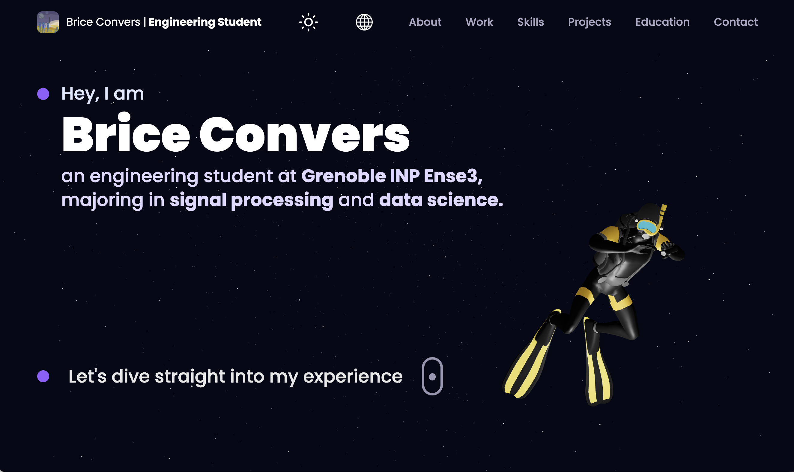

# **My Portfolio 3D**


You can find on this repo a website to present myself, my backgrounds and my IT projects.

<br/>

<p align="center">
	
</p>

## How to try a demo

You can find the project living here: **[briceconvers.com](https://www.briceconvers.com/)**.

## How to get stated

You can follow these steps to see the code on you local machine.

1. Open your terminal and go on you desired folder.
```bash
    cd [path_folder]
```

2. Clone the project.
```bash
    git clone [http_project_path]
```

3. Enter in the project.
```bash
    cd [repo_name]
```


4. Install dependencies. If you do not have npm, install it with : **[Download NPM](https://docs.npmjs.com/downloading-and-installing-node-js-and-npm)**.

```bash
    npm install
```

5. Launch the project, and go on the printed link.

```bash
   npm start dev
```

6. Enjoy !

## Debugs

If you are struggling with permissions and certenly you are on macOS, you can may be use this command :

```bash
sudo chown -R $USER .
```
You can try other flags in the command with this website: **[How to use chown command](https://www.computerhope.com/unix/uchown.htm)**.

# To Do List
What I plan to do in the future:

- [ ] Finish the translation in japanese.
- [ ] Details more about the internships and about hypotetical demo.
- [ ] Implement the functionality to choose a CV according the selected language.

# Credits

* [**Convers Brice**](https://github.com/) : Creator of the project.

